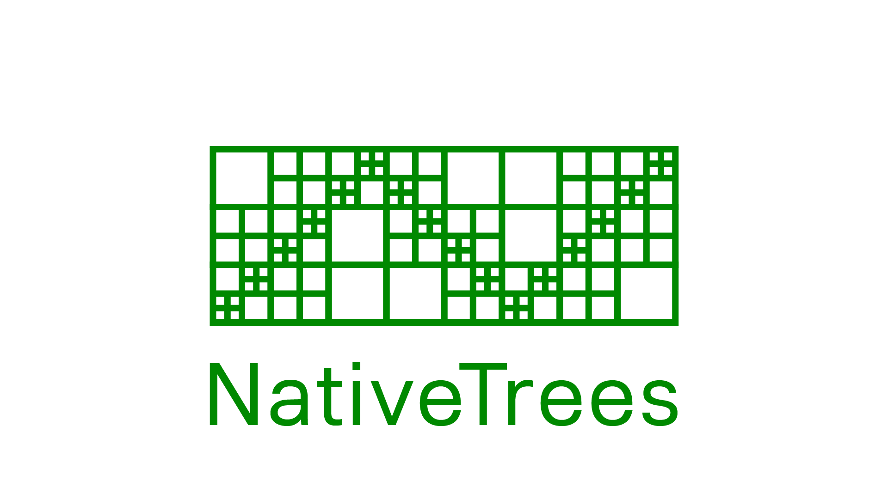

Generic sparse octree and quadtree
that store objects together with their axis aligned bounding boxes (AABB's)

## Overview

There are two samples included that show how to use the octree and quadtree.
The extension classes provide readymade solutions for AABB only checking. For more complicated
shapes you must provide your own ray/overlap/distance calculations.

### Insertion
The objects can be of any unmanaged type, when inserting, an AABB must be provided:

    // Insert a bunch of triangles
    for (int i = 0; i < tris.Length; i++)
    {
        var triangle = tris[i];
        octree.Insert(triangle, triangle.GetAABB());
    }

Often times however, it's more efficient to insert Id's that map to something outside of
the tree (like DOTS entities).

If you know your objects are points, you can insert them faster by using:

    // Insert entities that are 'points'
    for (int i = 0; i < entities.Length; i++)
    {
        var entity = entities[i];
        octree.InsertPoint(entities[i], positions[i]);
    }

Note that objects inserted as points only support range and nearest neighbour queries.

### Queries

All of the supported queries use the same pattern which is
to (ab)use structs as a sort of delegate. This separates collision/intersection
code from the type of objects, allowing you to insert even primitive types or types from another assembly.
This turned out to be the most efficent and easiest to implement while keeping things fully compatibly with Unity's Burst compiler.

### Raycast

A raycast query for example, requires you to implement IOctreeRayIntersecter which
acts as a delegate to determine if a ray intersects with an object that's in the tree.

    public static bool RaycastAABB<T>(this NativeOctree<T> octree, Ray ray, out OctreeRaycastHit<T> hit) where T : unmanaged
    { 
      return octree.Raycast<RayAABBIntersecter<T>>(ray, out hit);
    }

    struct RayAABBIntersecter<T> : IOctreeRayIntersecter<T>
    {
      public bool IntersectRay(in PrecomputedRay ray, T obj, AABB objBounds, out float distance)
      {
        return objBounds.IntersectsRay(ray, out distance);
      }
    }

The example above just tests the ray against the object's bounds. (See NativeOctreeExtensions) But you could go a step further
and test it against a triangle, a collider and so forth. Note that the tree itself
does not automatically test for Ray-AABB intersections on the objects, so it's usually a good decision to early exit
if the ray doesn't exit with the object's bounds since those checks are cheap.

### Nearest Neighbour
NativeTrees support nearest neighbour queries. You should implement IOctreeNearestVisitor and IOctreeDistanceProvider.

    struct AABBDistanceSquaredProvider<T> : IOctreeDistanceProvider<T> 
    {
        // Just return the distance squared to our bounds
        public float DistanceSquared(float3 point, T obj, AABB bounds) => bounds.DistanceSquared(point);
    }

    struct OctreeNearestAABBVisitor<T> : IOctreeNearestVisitor<T>
    {
        public T nearest;
        public bool found;
        
        public bool OnVist(T obj)
        {
            this.found = true;
            this.nearest = obj;
            
            return false; // immediately stop iterating at first hit
            // if we want the 2nd or 3rd neighbour, we could iterate on and keep track of the count!
        }
    }

The extensions classes show an example of these implementation. But only for AABB's.
If you need more detail on your distance, you can implement your type specific behaviour using these interfaces.

To get the nearest neighbour:

    var visitor = new OctreeNearestAABBVisitor<Entity>();
    octree.Nearest(point, maxDistance, ref visitor, default(AABBDistanceSquaredProvider<Entity>));
    Entity nearestEntity = visitor.nearest;

### Range

Here's an example that adds unique objects that overlap with a range to a hashset:

    public static void RangeAABBUnique<T>(this NativeOctree<T> octree, AABB range, NativeParallelHashSet<T> results) 
      where T : unmanaged, IEquatable<T>
    {
        var vistor = new RangeAABBUniqueVisitor<T>()
        {
            results = results
        };
     
        octree.Range(range, ref vistor);
    }

    struct RangeAABBUniqueVisitor<T> : IOctreeRangeVisitor<T> where T : unmanaged, IEquatable<T>
    {
        public NativeParallelHashSet<T> results;
        
        public bool OnVisit(T obj, AABB objBounds, AABB queryRange)
        {
            // check if our object's AABB overlaps with the query AABB
            if (objBounds.Overlaps(queryRange))
                results.Add(obj);

            return true; // always keep iterating, we want to catch all objects
        }
    }

It's important to note that the query itself iterates all of the objects that are in nodes that overlap with
the input range. An extra check should be performed to test if the object overlaps.
Also, if the objects aren't points, it's possible for them to be visited multiple times as they reside in more than one node.
A hashset can be used to only visit each object once.